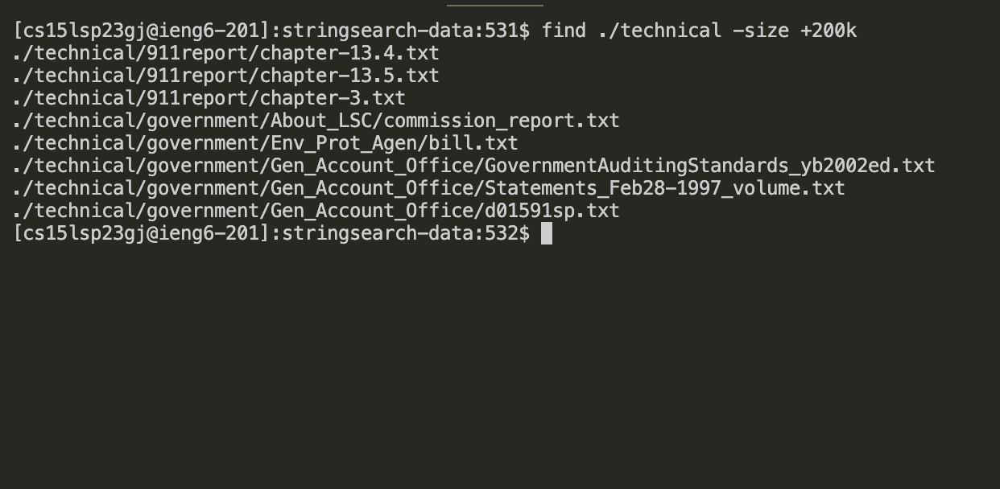

# Lab Report 3

**Command** `find`

**Alternates**

*The following commands were all found by going to the terminal and typing* `man find`

* `-size n[ckMGTP]` 

*Allows you to search for files based on their size, c for bytes, k for kilobytes, M for megabytes, G for gigabytes, T for terabytes , and P for petabytes. It's useful for locating files of a specific size or a range of size*

* `-type t` 

*Allows you to search for files based on their type, such as `d` for directories `f`for regular files. It's useful see all files of a type you have*

* `-newer file` 

*Allows you to search for files that are newer than a specified file. It's useful to track changes*

* `-iname pattern`

*Allows you search for files based on their name, however unlike `-name` it is case insensitive. It's useful for find files that may forgot what characters are uppercase or lowercase*

***

## Examples

**`-size n[ckMGTP]`**

``` # find ./technical -size +200k```

*this commands searches ./technincal for files that are above 200 kilobtyes. It's useful to find files within a range*



* ``` # find ./technical -size +1c```

*This command searches ./technical for files above 1 byte. It could be used to see all files.*


***

**`-type t`**

* ``` # find ./technical -type d```

*This command shows all directories. It can be useful to see all directories you have.*


* ``` # find ./technical -type f```

*This command shows all files. It can be useful to check all the files you have*


***

**`-newer file`**

* ``` # find ./technical -newer ./technical/government/Gen_Account_Office/Statements_Feb28-1997_volume.txt```

*Checks for a new files of a specifeid file. It can be useful to check for changes.*


* ``` # find ./techincal -newer ./technical -newer ./technical/government/Media/Aid_Gets_7_Million.txt ```

*Checks for a new files of a specifeid file. It can be useful to check for changes aswell.*


***

**`-iname pattern`**

* ``` # find ./technical -iname RR166.TXT```

*Finds files based on their names, however it's case insensitive. It's useful if you forgot what letters are uppercase/lowercase , but remember the name*


* ``` # find ./technical -iname POOR_LACKING_LEGAL_AID.TXT ```

*Finds files based on their names, however it's case insensitive. It's useful if you forgot what letters are uppercase/lowercase , but remember the name*


***
