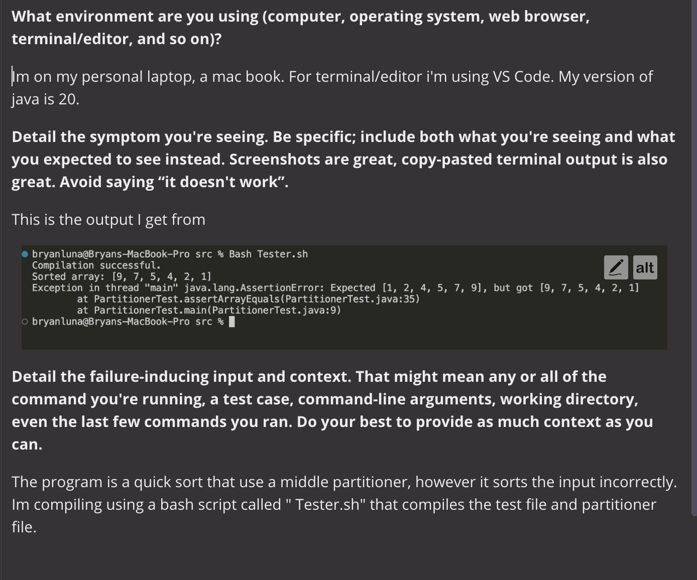
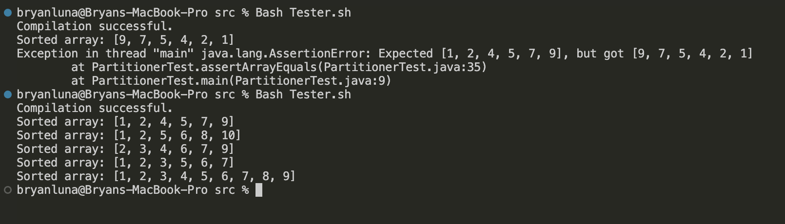

# Lab 5



**Instructor Response**

*From the message from the termerinal, your test failed.
Looking by the actual and it's expected results, the program did
sort the integers, however it's in descending order. 
This means the problem is occuring where your code is indentifying 
which integers are greator and less than your pivot. 
Look back at the logic of those methods*


**FIX



*The bug ended up being a logical error in the way the arrays were being partitioned.
By using > instead of < when attemping to find elements smaller than the pivot and
< instead of > for elements larger than the pivot the code incorrectly identifies the elements 
greater than the pivot as smaller and vice versa. As a result, the sorting order is reversed,
leading to incorrect sorting of the elements.*

## Before fix

```
# public class Partitioner {
    
    partitioner
    public static int partitionMiddlePivot(int[] arr, int low, int high) {
        int middle = low + (high - low) / 2;  
        int pivot = arr[middle];  // Pivot value

        while (low <= high) {
            while (arr[low] > pivot) { 
                low++;
            }

            while (arr[high] < pivot) {  
                high--;
            }

            if (low <= high) {
                swap(arr, low, high);
                low++;
                high--;
            }
        }

        return low;
    }

    swap helper method
    public static void swap(int[] arr, int i, int j) {
        int temp = arr[i];
        arr[i] = arr[j];
        arr[j] = temp;
    }
}

class QuickSort {
    public static void quickSort(int[] arr, int low, int high) {
        if (low < high) {
            int pivotIndex = Partitioner.partitionMiddlePivot(arr, low, high);
            quickSort(arr, low, pivotIndex - 1);
            quickSort(arr, pivotIndex, high);
        }
    }
}
import java.util.Arrays;

public class PartitionerTest {
    public static void main(String[] args) {
        int[] arr1 = {4, 2, 9, 1, 7, 5};
        QuickSort.quickSort(arr1, 0, arr1.length - 1);
        System.out.println("Sorted array: " + Arrays.toString(arr1));
        assertArrayEquals("[1, 2, 4, 5, 7, 9]", arr1);

        int[] arr2 = {10, 5, 8, 2, 1, 6};
        QuickSort.quickSort(arr2, 0, arr2.length - 1);
        System.out.println("Sorted array: " + Arrays.toString(arr2));
        assertArrayEquals("[1, 2, 5, 6, 8, 10]", arr2);

        int[] arr3 = {3, 9, 4, 6, 2, 7};
        QuickSort.quickSort(arr3, 0, arr3.length - 1);
        System.out.println("Sorted array: " + Arrays.toString(arr3));
        assertArrayEquals("[2, 3, 4, 6, 7, 9]", arr3);

        int[] arr4 = {7, 3, 5, 2, 1, 6};
        QuickSort.quickSort(arr4, 0, arr4.length - 1);
        System.out.println("Sorted array: " + Arrays.toString(arr4));
        assertArrayEquals("[1, 2, 3, 5, 6, 7]", arr4);

        int[] arr5 = {9, 8, 7, 6, 5, 4, 3, 2, 1};
        QuickSort.quickSort(arr5, 0, arr5.length - 1);
        System.out.println("Sorted array: " + Arrays.toString(arr5));
        assertArrayEquals("[1, 2, 3, 4, 5, 6, 7, 8, 9]", arr5);
    }

        public static void assertArrayEquals(String expected, int[] actual) {
            String actualStr = Arrays.toString(actual);
            if (!expected.equals(actualStr)) {
                throw new AssertionError("Expected " + expected + ", but got " + actualStr);
            }
        }
    }
```

## After fix
```
# public class Partitioner {
    
    
    public static int partitionMiddlePivot(int[] arr, int low, int high) {
        int middle = low + (high - low) / 2;  
        int pivot = arr[middle];  // Pivot value

        while (low <= high) {
            while (arr[low] < pivot) {  
                low++;
            }

            while (arr[high] > pivot) {  
                high--;
            }

            if (low <= high) {
                swap(arr, low, high);
                low++;
                high--;
            }
        }

        return low;
    }

    //swap helper method
    public static void swap(int[] arr, int i, int j) {
        int temp = arr[i];
        arr[i] = arr[j];
        arr[j] = temp;
    }
}

class QuickSort {
    public static void quickSort(int[] arr, int low, int high) {
        if (low < high) {
            int pivotIndex = Partitioner.partitionMiddlePivot(arr, low, high);
            quickSort(arr, low, pivotIndex - 1);
            quickSort(arr, pivotIndex, high);
        }
    }
}

import java.util.Arrays;


public class PartitionerTest {
    public static void main(String[] args) {
        int[] arr1 = {4, 2, 9, 1, 7, 5};
        QuickSort.quickSort(arr1, 0, arr1.length - 1);
        System.out.println("Sorted array: " + Arrays.toString(arr1));
        assertArrayEquals("[1, 2, 4, 5, 7, 9]", arr1);

        int[] arr2 = {10, 5, 8, 2, 1, 6};
        QuickSort.quickSort(arr2, 0, arr2.length - 1);
        System.out.println("Sorted array: " + Arrays.toString(arr2));
        assertArrayEquals("[1, 2, 5, 6, 8, 10]", arr2);

        int[] arr3 = {3, 9, 4, 6, 2, 7};
        QuickSort.quickSort(arr3, 0, arr3.length - 1);
        System.out.println("Sorted array: " + Arrays.toString(arr3));
        assertArrayEquals("[2, 3, 4, 6, 7, 9]", arr3);

        int[] arr4 = {7, 3, 5, 2, 1, 6};
        QuickSort.quickSort(arr4, 0, arr4.length - 1);
        System.out.println("Sorted array: " + Arrays.toString(arr4));
        assertArrayEquals("[1, 2, 3, 5, 6, 7]", arr4);

        int[] arr5 = {9, 8, 7, 6, 5, 4, 3, 2, 1};
        QuickSort.quickSort(arr5, 0, arr5.length - 1);
        System.out.println("Sorted array: " + Arrays.toString(arr5));
        assertArrayEquals("[1, 2, 3, 4, 5, 6, 7, 8, 9]", arr5);
    }

        public static void assertArrayEquals(String expected, int[] actual) {
            String actualStr = Arrays.toString(actual);
            if (!expected.equals(actualStr)) {
                throw new AssertionError("Expected " + expected + ", but got " + actualStr);
            }
        }
    }
```
