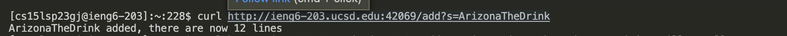
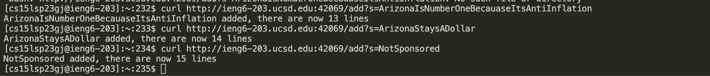
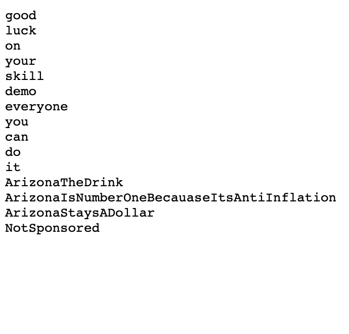

# Lab Report 2


## Part 1


```
# class StringHandler implements URLHandler {
  List<String> lines;
  String path;
  StringHandler(String path) throws IOException {
    this.path = path;
    this.lines = Files.readAllLines(Paths.get(path));
  }
  public String handleRequest(URI url) throws IOException {
    String query = url.getQuery();
    if(url.getPath().equals("/add")) {
      if(query.startsWith("s=")) {
        String toAdd = query.split("=")[1];
        this.lines.add(toAdd);
        return String.format("%s added, there are now %s lines\n", toAdd, this.lines.size());
      }
      else {
        return "/add requires a query parameter s\n";
      }
    }
    else if(url.getPath().equals("/save")) {
      String toSave = String.join("\n", lines) + "\n";
      Files.write(Paths.get(this.path), toSave.getBytes());
      return "Saved!\n";
    }
    else if(url.getPath().equals("/search")) {
      if(query.startsWith("q=")) {
        String toSearch = query.split("=")[1];
        String result = "";
        for(String s: lines) {
          if(s.contains(toSearch)) {
            result += s + "\n";
          }
        }
        return result;
      }
      else {
        return "/search requires a query parameter q\n";
      }
    }
    else {
      return String.join("\n", lines) + "\n";
    }
  }
}

class StringServer {
  public static void main(String[] args) throws IOException {
    if(args.length == 0){
      System.out.println("Missing port number! Try any number between 1024 to 49151");
      return;
    }
    if(args.length == 1){
      System.out.println("Missing file path! Give a path to a text file as the second argument.");
      return;
    }

    int port = Integer.parseInt(args[0]);

    Server.start(port, new StringHandler(args[1]));
  }
}

```

*This is the first string added*


*This is adding the rest of the strings*


*The results after adding Strings*


**Questions**

* Which methods in your code are called?
* What are the relevant arguments to those methods, and the values of any relevant fields of the class?
* How do the values of any relevant fields of the class change from this specific request? If no values got changed, explain why.

**Answers**

* *The handleRequest method*
* *The class fields are path and lines*
* *lines becomes modified*


## Part 2

**Original Code**

  ```
  # static int[] reversed(int[] arr) {
    int[] newArray = new int[arr.length];
    for(int i = 0; i < arr.length; i += 1) {
      arr[i] = newArray[arr.length - i - 1];
    }
    return arr;
  }
  ```
  
  
  **JUnit Testing**
  
  *Creates a failure inducing output*
  ```
  # @Test
  Public void testReversed(){
  
  int array = {1,2,4,5};
    int[] result = array.reversed();
  
  assertArrayEquals(array,result);
  
  }
  ```
*** 
**Corrected Code**

*The error of the code was that it wasnt properly reversing the array. In the fourth line the wrong code uses `arr[i] = newArray[arr.length-i-1]`, which is incorrect because arr is copying from the wrong array. It instead should the other way around, that way new array is copying from the inputed array*

  ```
  # static int[] reversed(int[] arr) {
    int[] newArray = new int[arr.length];
    for(int i = 0; i < arr.length; i += 1) {
      newArray[i] = arr[arr.length - i - 1];
    }
    return newArray;
  }
  ```
  
  
  
  
  **JUnit Testing**
  
  *Does not create a failure inducing output using the orignal code*
  
  ```
  # @Test
  public void testReversed(){
  
  int[] array = {100};
  int[] result = array.reversed();
  
  assertArrayEquals(array,result);
  
  }
  ```
  *This won't give a faulure inducing code becuase there's only element in the array, so nonthing much needs to be done, since reversing a single element is the same thing as the orginal. This would go through because there isnt any check if the array has mulptile elements.*


# Part 3

*What I've learned durin lab 2 and 3, was know what a relative path, working directory, and absolute path. I learned how to determine what the absolute path will be the outcome of an working directory and relative path.*
