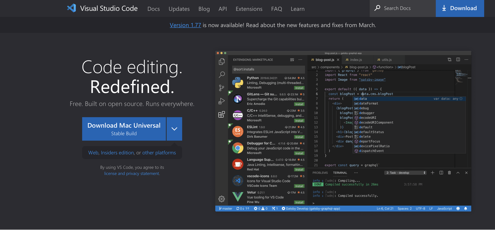
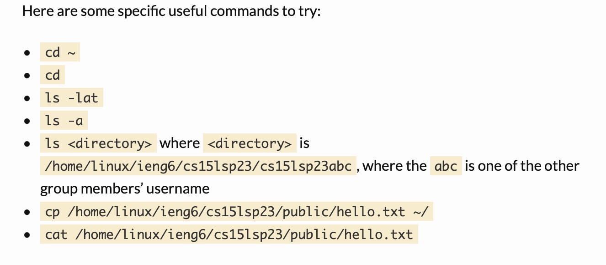
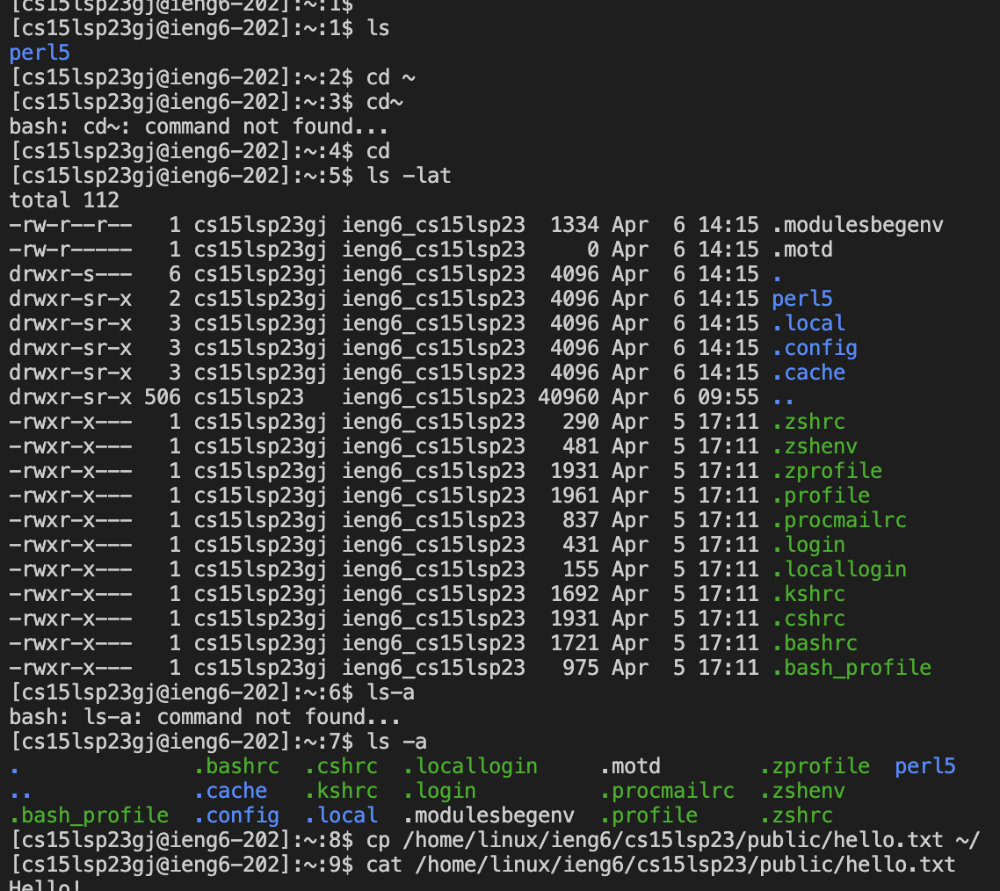

# Lab Report 1

**To download VsCode go their website, and download the version, accoridng to your device**

**After you download VsCode, this should be the interface you see when it's open**

**To romotely connect, you must use ssh, and input ssh cs15lsp23zz@ieng6.ucsd.edu(make sure the "zz" is replaced by your account letters). You will be prompt questions, and you will say yes to all. You then will need to enter your ad password. After all that, the following will be showed:**

**Run the following commands.**

**After the commands are written you should end up with the following:**

