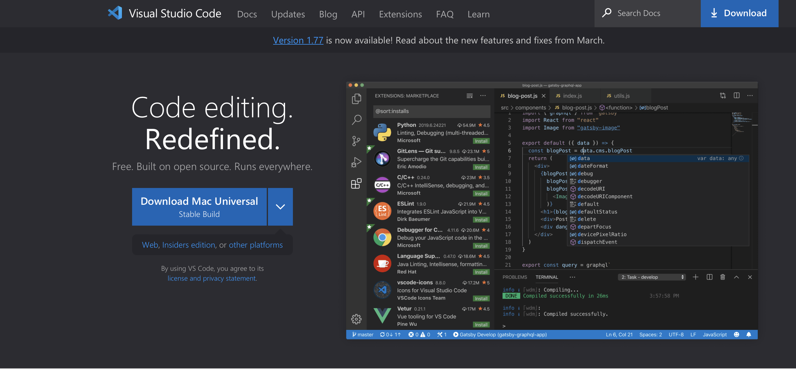
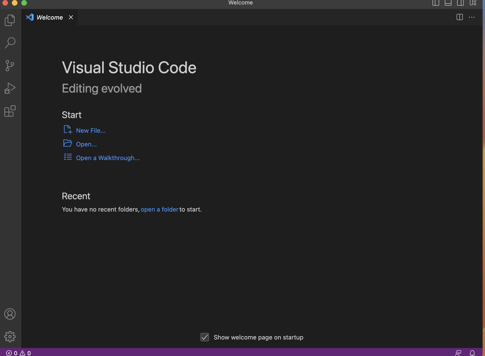
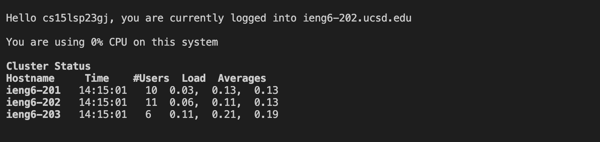
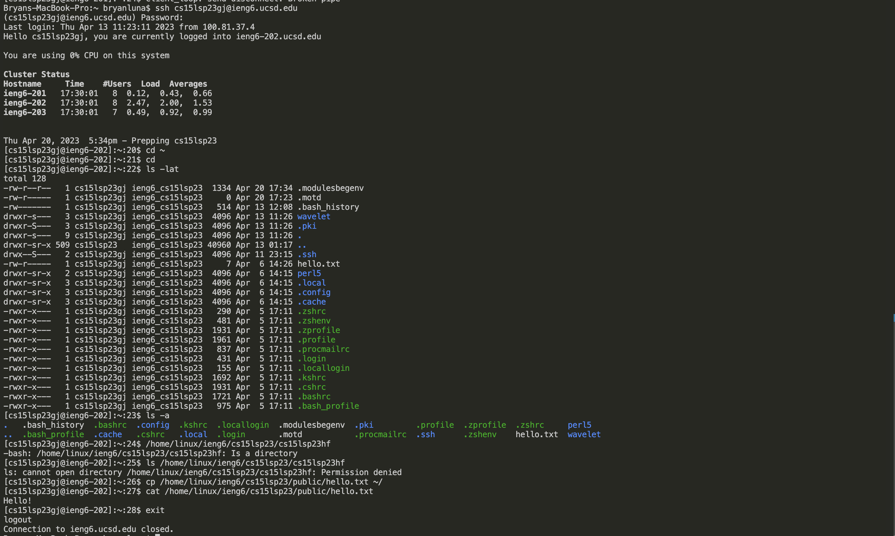

# Lab Report 1

**First, You will need to download Visual Studio Code.To download Visual Studio Code, you can use this link to take you there directly [Link](https://code.visualstudio.com/). Click the arrow next to the download button. Be sure to download the correct version according to your device**

**After you download VsCode, this should be the interface you see when it's open. Now we will start to connect romotely, open the terminal in VScode and follow the next follwing steps:**

**To romotely connect, you must use ssh, and input `ssh cs15lsp23zz@ieng6.ucsd.edu` (make sure the "zz" is replaced by your account letters). You will be prompt questions, and you will say yes to all. You then will need to enter your ad password. After all that, the following will be showed:**

**Run the following commands.**

* `cd ~` **changes the current directory to the home directory**
* `cd` **allows you to change between directories**
* `ls -lat` **Puts all contents in a directory in a list format, in a date from most recents to the oldest content**
* `ls -a` **list all files and directories, even the hidden ones**
* `ls <directory>` **where** `<directory>` **is** `/home/linux/ieng6/cs15sp23/cs15sp23abc`, **where abc is a group memebers' username**
* `cp /home/linux/ieng6/cs15sp23/public/hello.txt~/` **copies a file**
* `cat /home/linux/ieng6/cs15sp23/public/hello.txt` **prints out what's in the hello.txt file**

**After the commands are written you should end up with the following:**

